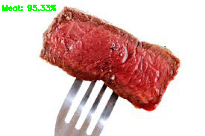

# Fine-tune VGG16 to Implement Food Classification 
We are going to classify images from our dataset into 11 classes of food,
by utilizing transfer learning via feature extraction. 

## Dataset
Please download [Food-11 dataset](https://mmspg.epfl.ch/downloads/food-image-datasets/) via FileZilla 
and extract it to the root path of our project before moving on.

FileZilla's credentials:
* __Host:__ tremplin.epfl.ch
* __Username:__ FoodImage@grebvm2.epfl.ch
* __Password:__ Cahc1moo

## Project struture
* __Food-11/__
    - __evaluation/__
    - __training/__
    - __validation/__
* __dataset/__ 
* __output/__ 
* __utilities/__
* __build_dataset.py__
* __extract_feature.py__
* __train.py__
* __predict.py__

## How to run

1. __Step 1:__ build our dataset

```
python build_dataset.py
```

2. __Step 2:__ extract features using VGG16

```
python extract_features.py
```

3. __Step 3:__ train and evaluate the model

```
python train.py
```

4. __Step 4:__ make prediction 

```
python predict.py --image dataset/evaluation/Seafood/8_186.jpg
```

## Demo




